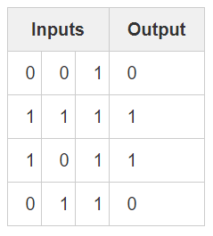
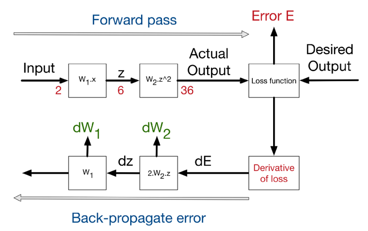
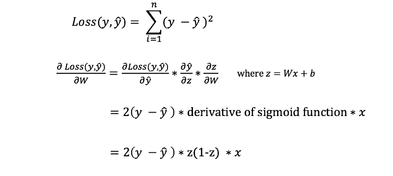

# Building-a-Neural-network
Learn to Build a Neural Network from Scratch.

### Motivation: 
As part of my personal journey to gain a better understanding of Deep Learning, I’ve decided to build a Neural Network from scratch without a deep learning library like TensorFlow. I believe that understanding the inner workings of a Neural Network is important to any aspiring Data Scientist.

__Hello world,__
In this repo, we will learn about Neural networks and also how to build Neural Networks by playing with some toy codes.

In simple words, Neural networks are "computer system modelled on the human brain and nervous system".
Neural Networks comprizes of Artificial neurons. 

### But, what the hack is an Artificial neuron?
Well, there is no rocket science,
Consider this image below to understand.


In that Artificial neuron, you can see an encircled equation in the middle, that equation is nothing but an Activation function, if you want to learn about them [here](https://github.com/Optimist-Prime/A-Story-of-Activation-Functions) is the link.
'x' is the input and 'w' is the weight. __weight__ refers to the strength or amplitude of a connection between two nodes, corresponding in biology to the amount of influence the firing of one neuron has on another.

Assuming that you totally understood above image, we may proceed further.

### Now lets take look at some Mathematics.

refer to _Math Notation Cheat Sheet.png_.

A Neural Network Consists of the following Components:-.
__1.__ An input layer, x.
__2.__ An arbitrary amount of hidden layers.
__3.__ An output layer, ŷ.
__4.__ A set of weights and biases between each layer, W and b.
__5.__ A choice of activation function for each hidden layer, σ. In this tutorial, we’ll use a Sigmoid activation function.

### Now lets build our first neural network in python.
only dependency here is numpy.

```python
class NeuralNetwork:
    def __init__(self, x, y):
        self.input      = x
        self.weights1   = np.random.rand(self.input.shape[1],4) 
        self.weights2   = np.random.rand(4,1)                 
        self.y          = y
        self.output     = np.zeros(y.shape)
```
Thats it.

__Now lets use a Neural Network for some tabular problem:__
Refer to code _Simple_NN.py_

```python
import numpy as np

X = np.array([ [0,0,1],[0,1,1],[1,0,1],[1,1,1] ])
y = np.array([[0,1,1,0]]).T

syn0 = 2*np.random.random((3,4)) - 1
syn1 = 2*np.random.random((4,1)) - 1

for j in xrange(60000):
    l1 = 1/(1+np.exp(-(np.dot(X,syn0))))
    l2 = 1/(1+np.exp(-(np.dot(l1,syn1))))
    l2_delta = (y - l2)*(l2*(1-l2))
    l1_delta = l2_delta.dot(syn1.T) * (l1 * (1-l1))
    syn1 += l1.T.dot(l2_delta)
    syn0 += X.T.dot(l1_delta)
```
The code above will be used to predict the output of three inputs in the table given below.


We could solve this problem by simply measuring statistics between the input values and the output values. If we did so, we would see 
that the leftmost input column is perfectly correlated with the output. Backpropagation, in its simplest form, measures statistics like
this to make a model. Let's jump right in and use it to do this.

Naturally, the right values for the weights and biases determines the strength of the predictions. The process of fine-tuning the weights and biases from the input data is known as _training the Neural Network._

Each iteration of the training process consists of the following steps:

__1.__ Calculating the predicted output ŷ, known as feedforward.
__2.__ Updating the weights and biases, known as backpropagation.

### Loss Function.
In order to be able to generalise to any problem, we define what we call: loss function. Basically it is a performance metric on how well the NN manages to reach its goal of generating outputs as close as possible to the desired values.

The most intuitive loss function is simply loss = (Desired output — actual output). However this loss function returns positive values when the network undershoot (prediction < desired output), and negative values when the network overshoot (prediction > desired output). If we want the loss function to reflect an absolute error on the performance regardless if it’s overshooting or undershooting we can define it as:
loss = Absolute value of (desired — actual ).
However, several situations can lead to the same total sum of errors: for instance, lot of small errors or few big errors can sum up exactly to the same total amount of error. Since we would like the prediction to work under any situation, it is more preferable to have a distribution of lot of small errors, rather than a few big ones.
In order to encourage the NN to converge to such situation, we can define the loss function to be the sum of squares of the absolute errors (which is the most famous loss function in NN). This way, small errors are counted much less than large errors! (the square of 2 is 4, but the square of 10 is 100! So an error of 10, is penalised 25 times more than an error of 2 — not only 5 times!).

As a __summary__, _the loss function is an error metric, that gives an indicator on how much precision we lose, if we replace the real desired output by the actual output generated by our trained neural network model. That’s why it’s called loss!_

__Note :__ Loss function is used in the last layer of a Neural network. The most commonly used loss function is __Softmax__. 

### Backpropagation... What is this? 
_Backpropagation is a method used in artificial neural networks to calculate a gradient that is needed in the calculation of the weights to be used in the network._ Quite wiered definition huh!. let's understand this thing further as it appears to be quite important. Yes it is.

_The motivation for backpropagation is to train a multi-layered neural network such that it can learn the appropriate internal representations to allow it to learn any arbitrary mapping of input to output._
But why we are using it here?, infact, what is its role?.
_The goal of any supervised learning algorithm is to find a function that best maps a set of inputs to their correct output. An example would be a classification task, where the input is an image of an animal, and the correct output is the type of animal (e.g.: dog, cat, giraffe, lion, zebra, etc.)._



In order to know the appropriate amount to adjust the weights and biases by, we need to know the derivative of the loss function with respect to the weights and biases.

Recall from calculus that the derivative of a function is simply the slope of the function.
If we have the derivative, we can simply update the weights and biases by increasing/reducing with it(refer to the diagram above). This is known as gradient descent.


However, we can’t directly calculate the derivative of the loss function with respect to the weights and biases because the equation of the loss function does not contain the weights and biases. Therefore, we need the chain rule to help us calculate it.



Hmm.. It's ugly, but it allows us to get what we needed — the derivative (slope) of the loss function with respect to the weights, so that we can adjust the weights accordingly.

__Let's have a look at its Algorithm.__


__Let's code our feed forward and Backpropagation:.__
```python
class NeuralNetwork:
    def __init__(self, x, y):
        self.input      = x
        self.weights1   = np.random.rand(self.input.shape[1],4) 
        self.weights2   = np.random.rand(4,1)                 
        self.y          = y
        self.output     = np.zeros(self.y.shape)

    def feedforward(self):
        self.layer1 = sigmoid(np.dot(self.input, self.weights1))
        self.output = sigmoid(np.dot(self.layer1, self.weights2))

    def backprop(self):
        # application of the chain rule to find derivative of the loss function with respect to weights2 and weights1
        d_weights2 = np.dot(self.layer1.T, (2*(self.y - self.output) * sigmoid_derivative(self.output)))
        d_weights1 = np.dot(self.input.T,  (np.dot(2*(self.y - self.output) * sigmoid_derivative(self.output), self.weights2.T) * sigmoid_derivative(self.layer1)))

        # update the weights with the derivative (slope) of the loss function
        self.weights1 += d_weights1
        self.weights2 += d_weights2
```
Easy enough, huh!

Now, let's stick to that tabular thing again and expand it by training a 2-Layer neural network.

### 2-Layer Neural Network

Refer to the code _Two_L_NN.py_.
```python
import numpy as np

# sigmoid activation function
def nonlin(x,deriv=False):
if(deriv==True):
return x*(1-x)
return 1/(1+np.exp(-x))

# input dataset
X = np.array([  [0,0,1],
[0,1,1],
[1,0,1],
[1,1,1] ])

# output dataset           
y = np.array([[0,0,1,1]]).T

# seed random numbers to make calculation
# deterministic (just a good practice)
np.random.seed(1)

# initialize weights randomly with mean 0
syn0 = 2*np.random.random((3,1)) - 1
for iter in range(10000):
# forward propagation
  l0 = X
  l1 = nonlin(np.dot(l0,syn0))
  # how much did we miss?
  l1_error = y - l1
  # multiply how much we missed by the
  # slope of the sigmoid at the values in l1
  l1_delta = l1_error * nonlin(l1,True)
  # update weights
  syn0 += np.dot(l0.T,l1_delta)

print "Output After Training:"
print l1
```

Output of Above Function will be as.
```
Output After Training:
[[ 0.00966449]
 [ 0.00786506]
 [ 0.99358898]
 [ 0.99211957]]
```

As you can see in the "Output After Training", it works!!! (A GREAT ROUND OF APPLAUSE FOR YA!!!) Before I describe processes, 
I recommend playing around with the code to get an intuitive feel for how it works.

Refer to _Two_L_NN.ipynb_ file. Above Code is explained there in detail. (NOT ADDAED YET)

### 3 Layered Neural network

```python
import numpy as np


def nonlin(x,deriv=False):
    if(deriv==True):
        return x*(1-x)
        return 1/(1+np.exp(-x))

X = np.array([[0,0,1],
[0,1,1],
[1,0,1],
[1,1,1]])

y = np.array(
    [[0],
    [1],
    [1],
    [0]])

np.random.seed(1)

# randomly initialize our weights with mean 0
syn0 = 2*np.random.random((3,4)) - 1
syn1 = 2*np.random.random((4,1)) - 1

for j in xrange(60000):
    # Feed forward through layers 0, 1, and 2
    l0 = X
    l1 = nonlin(np.dot(l0,syn0))
    l2 = nonlin(np.dot(l1,syn1))
    # how much did we miss the target value?
    l2_error = y - l2
    if (j% 10000) == 0:
        print ("Error:" + str(np.mean(np.abs(l2_error))))
       # in what direction is the target value?
    # were we really sure? if so, don't change too much.
    l2_delta = l2_error*nonlin(l2,deriv=True)
    # how much did each l1 value contribute to the l2 error (according to the weights)?
    l1_error = l2_delta.dot(syn1.T)
    # in what direction is the target l1?
    # were we really sure? if so, don't change too much.
    l1_delta = l1_error * nonlin(l1,deriv=True)
    syn1 += l1.T.dot(l2_delta)
    syn0 += l0.T.dot(l1_delta)
```

Output will be.

```
Error:0.496410031903
Error:0.00858452565325
Error:0.00578945986251
Error:0.00462917677677
Error:0.00395876528027
Error:0.00351012256786
```
LOL, Don't be upset with a lot of 'Error' in the output.
This code is Explained in _Three_L_NN.ipynb_.   (NOT ADDED YET)

Not making this __README.md__ too log to read, lets end this Tutorial here.

I hope that, today you learnt a lot about Neural Networks. 
Although Deep Learning libraries such as TensorFlow and Keras makes it easy to build deep nets without fully understanding the inner workings of a Neural Network, I find that it’s beneficial for aspiring data scientist to gain a deeper understanding of Neural Networks.
__Wait!!__ Is it all about Neural networks?.
Are you a master now?

No friend, It's just a beginning, there is a lot of stuff to learn. However you get a nice start, so lets smile togather and start _coading and Experimenting_. Yeahh, also learning.

you may mail (mohit.gupta2jly@gmail.com) me if you have any issues. Be specific and I will try to write in as easy as possible and brief way, cuz I hate typing.

__NOTE :__ We will Learn to build Convolutional-Neural-Networks in next Repo, stay tuned.
